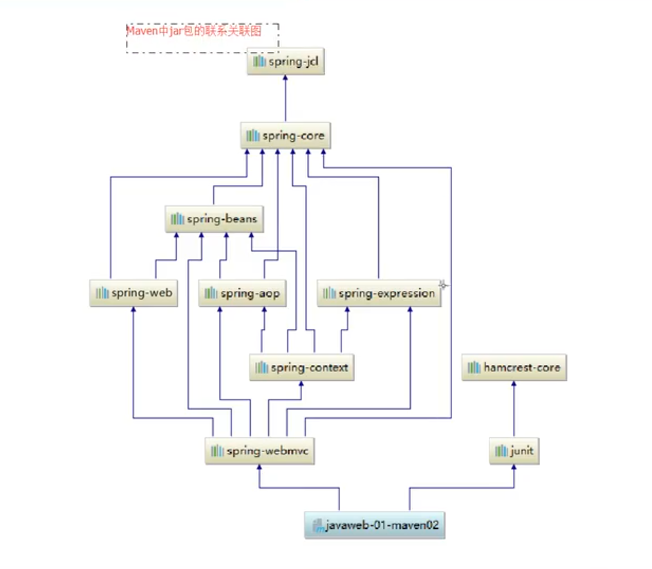

分析原理-看源码

# 基本概念

## 1.1 前言

Web：网页开发，从服务器上取资源

静态Web：html，css

动态Web：提供差异的信息，不同时间，不同用户

- 技术栈：Servlet+JSP，ASP，PHP

Java中，动态Web开发的技术统称Java Web

## 1.2 Web应用程序

Web应用程序：可提供浏览器访问的程序

- x.html，可被访问，提供服务
- 可访问的页面和资源，是存储在某个实体上
- URL
- 统一的Web资源放置在一个文件夹下，Web应用程序--依赖于>Tomcat服务器
- 一个Web应用有多部分组成，
  - html，css，js
  - jsp，servlet
  - Java程序
  - jar包
  - 配置文件（Properties）

## 1.3 静态Web

-  \*.htm, \*.html, 如果服务器中存在，可以直接读取，通信： 

  

- 缺点：
  - 无法动态更新，所有用户同一界面
    - 轮播图，点击特效：伪动态
    - Javascript[实际开发中，用的最多]
    - VBScript(过时)
  - 未和数据库交互（数据无法持久化，用户无法交互）

## 1.4 动态Web

页面动态展示：“Web页面展示效果因人而异”


缺点：

- 假如Server的动态资源出现错误，需要重新编写**后台程序**，重新发布
  - 停机维护

优点：

- 可以动态更新，所有用户不同界面

- 和数据库交互（数据持久化，用户交互）

  


# Web服务器

## 2.1 技术讲解

ASP：

- 微软：国内最早流行
- 在HTML中嵌入VB脚本，ASP+COM
- ASP开发中，基本一个Page有几千行业务代码，页面极其混乱
- 维护成本高
- C#+IIS

```html
<h1>
    <h1></h1h1>
    
    <%
      System.out.println("hello")      
     %>
</h1>
```

php：

- 开发速度快，功能很强大，跨平台，代码很简单
- 无法承载大访问量（局限性）

JSP+Servlet：

- sun公司主推B/S架构
- 基于Java语言（所有大公司，或者一些开源组件，都用Java写的）
- 可以承载三高问题（高并发，高性能，高可用）
- 语法像ASP，ASP->JSP，加强市场强度

...others

## 2.2 Web服务器

服务器是一种被动操作，用来处理用户请求+返回用户响应

**IIS**

微软的，ASP，Win自带的

**Tomcat**

Tomcat是Apache 软件基金会（Apache Software Foundation）的Jakarta 项目中的一个核心项目，由[Apache](https://baike.baidu.com/item/Apache/6265)、Sun 和其他一些公司及个人共同开发而成。由于有了Sun 的参与和支持，最新的Servlet 和JSP 规范总是能在Tomcat  中得到体现，Tomcat 5支持最新的Servlet 2.4 和JSP 2.0 规范。因为Tomcat  技术先进、性能稳定，而且**免费**，因而深受Java 爱好者的喜爱并得到了部分软件开发商的认可，成为目前比较流行的Web 应用服务器。

Tomcat 服务器是一个免费的开放源代码的Web 应用服务器，属于轻量级应用[服务器](https://baike.baidu.com/item/服务器)，在中小型系统和并发访问用户不是很多的场合下被普遍使用，是开发和调试JSP 程序的首选。对于一个初学者来说，可以这样认为，当在一台机器上配置好Apache 服务器，可利用它响应[HTML](https://baike.baidu.com/item/HTML)（[标准通用标记语言](https://baike.baidu.com/item/标准通用标记语言/6805073)下的一个应用）页面的访问请求。实际上Tomcat是Apache 服务器的扩展，但运行时它是独立运行的，所以当你运行tomcat 时，它实际上作为一个与Apache 独立的进程单独运行的。

Tomcat 实际上运行JSP 页面和Servlet。目前Tomcat最新版本为**9.0.31。**

**工作三到五年之后，可以尝试手写Tomcat服务器。（三天就行）**

下载tomcat：

- 安装或解压
- 了解配置文件+目录结构

**进入jdk，查看rt.jar和src.zip**

- 了解作用

# Tomcat

## 3.1 Tomcat安装

## 3.2 Tomcat启动和配置


启动，关闭Tomcat，访问：.\bin\start.bat, .\bin\shutdown.bat, localhost:8080

可能问题：

- Java环境变量未配置
- 闪退问题：配置兼容性
- 乱码问题：配置文件中修改


servel.xml修改：

- 可以配置启动端口号

```xml
<Connector port="80" protocol="HTTP/1.1"
           connectionTimeout="20000"
           redirectPort="8443" />
```
- 可以配置主机名：
  - 默认主机名：localhost->127.0.0.1
  - 默认网站应用存放位置：webapps

```xml
  <Host name="www.wyc.com"  appBase="webapps"
        unpackWARs="true" autoDeploy="true">
```
**高难度面试题**：

请谈谈如何网站是如何访问的？

1. 输入一个域名；回车

2. 检查本机[hosts配置文件](C:\Windows\System32\drivers\etc)有无这个域名映射

   - 有👉返回ip地址，直接访问
   - 无👉去DNS服务器找，找到返回，找不到返回找不到

   

## 3.3 发布一个网站

不会就先模仿

将网站放在webapps文件夹下：

```java
--webapps:Tomcat服务器的web目录
    -ROOT
    -examples:学习jsp，servlet，websocket页面
    -Yichuan
    	-WEB-INF
    		-classes:java程序
    		-lib：web应用所依赖的jar包
             -web.xml：网站配置文件
        -index.html：默认首页
        -static
                -css
                	-style.css
                -js
                -img
        -...
```

# HTTP协议

## 4.1 什么是HTTP协议

http（超文本传输协议）是一个简单的请求-响应协议，它通常运行在TCP之上。

- 文本：html，字符串，...
- 超文本：图片，音乐，视频，定位，地图，...

https：安全的，port-443

## 4.2 两个时代

- http1.0
  - HTTP/1.0：客户端可以与web服务器连接，只能获得一个web资源，之后断开连接
- http2.0
  - HTTP/1.1：客户端可以与web服务器连接，能获得多个web资源
  - HTTP/2.0

## 4.3 HTTP请求

client--request-->server

[百度](www.baidu.com)：

```请求行
Request URL: https://www.baidu.com/
Request Method: GET	
Status Code: 200 OK
Remote Address: 153.37.235.5:443
Referrer Policy: no-referrer-when-downgrade
```

```消息头
Accept:text/html
Accept-Encoding: gzip, deflate, br
Accept-Language: zh-CN,zh;q=0.9
Cache-Control: max-age=0
Connection: keep-alive
```

1. 请求行：
   - 请求方式：**GET，POST**，HEAD，DELETE，PUT，TRACT
     - GET：请求携带参数比较少，大小有限制，会在URL显示数据内容，不安全但高效
     - POST：请求携带参数个数与大小无限制，不会在URL显示数据内容，安全但不高效
2. 消息头：

```消息头
Accept:告诉浏览器，它所支持的数据类型
Accept-Encoding: 支持的编码格式：GBK，UTF-8，GB2312，ISO8859-1
Accept-Language: 告诉浏览器，它的语言环境
Cache-Control: 缓存控制
Connection: 告诉浏览器，请求完成是断开or保持连接
```

## 4.4 HTTP响应

server--response-->client

[百度](www.baidu.com)：

```java
Cache-Control: private
Connection: keep-alive
Content-Encoding: gzip
Content-Type: text/html
```

1. 响应体：

```java
Accept:告诉浏览器，它所支持的数据类型
Accept-Encoding: 支持的编码格式：GBK，UTF-8，GB2312，ISO8859-1
Accept-Language: 告诉浏览器，它的语言环境
Cache-Control: 缓存控制
Connection: 告诉浏览器，请求完成是断开or保持连接
HOST：主机.../
Refresh：告诉服务端，多久刷新一次
Location：让网页重新定位
```

2. [响应状态码](https://developer.mozilla.org/zh-CN/docs/Web/HTTP/Status)：

   | 状态码 | 作用       |
   | ------ | ---------- |
   | 1**    | 信息响应   |
   | 2**    | 成功响应   |
   | 3**    | 重定向     |
   | 4**    | 客户端响应 |
   | 5**    | 服务端响应 |
   |        |            |

^(*￣(oo)￣)^：200响应成功，404资源不存在，500服务器代码错误，502网关错误


**常见面试题：**

从浏览器中输入URL并回车的一瞬间到页面能够显示回来，经历了什么？（伴随整个Spring Web学习过程加深）

# Maven

Why：

1. 在java web开发中，需要使用大量jar包，需要手动导入

2. Maven辅助以自动导入和配置jar包

## 5.1 Maven项目架构管理工具

Maven的核心思想：约定大于配置

Maven规定如何编写java代码

## 5.2 下载Maven

## 5.3 配置环境变量

设置如下环境变量：

- M2_HOME: D:\SoftWare\apache-maven-3.6.3\bin
- MAVEN_HOME: D:\SoftWare\apache-maven-3.6.3
- Path:%MAVEN_HOME%\bin


## 5.4 修改配置文件

镜像：加速访问

国内选用阿里云，直接百度搜索《MAVEN+阿里云》

setting.xml-Tag<kbd>mirrors</kbd>

```xml
<mirror>
    <id>nexus-aliyun</id>
    <mirrorOf>central</mirrorOf>
    <name>Nexus aliyun</name>
    <url>http://maven.aliyun.com/nexus/content/groups/public</url> 
</mirror>
```

## 5.5 建立本地仓库

本地仓库，远程仓库

创建仓库文件夹maven_repo并配置如下：

```xml
<localRepository>D:\SoftWare\apache-maven-3.6.3\maven_repo</localRepository>
```

## 5.6 IDEA使用MAVEN


^(*￣(oo)￣)^：IDEA能识别MAVEN路径，是因为配置了环境变量

- 等待项目自动导入完毕。


- 观察MAVEN仓库中多了什么东西

- 

项目创建成功后，检查Maven配置


## 5.7 创建一个干净的MAVEN项目

不选择模板，直接创建


注意，此项目下无webapps目录，因为只有在web项目中才有。

## 5.8 标记文件夹功能


## 5.9 在IDEA中配置Tomcat


## 5.10 pom.xml

pom.xml是Maven的核心配置文件


```XML
<?xml version="1.0" encoding="UTF-8"?>

<!--Maven版本和头文件-->
<project xmlns="http://maven.apache.org/POM/4.0.0" xmlns:xsi="http://www.w3.org/2001/XMLSchema-instance"
  xsi:schemaLocation="http://maven.apache.org/POM/4.0.0 http://maven.apache.org/xsd/maven-4.0.0.xsd">
  <modelVersion>4.0.0</modelVersion>

<!--刚才配置的GAV-->
  <groupId>top.1river</groupId>
  <artifactId>TEST_Maven_1st</artifactId>
  <version>1.0-SNAPSHOT</version>
<!--项目打包格式：jar-java应用，war-javaweb应用-->
  <packaging>war</packaging>

  <name>TEST_Maven_1st Maven Webapp</name>
  <!-- FIXME change it to the project's website -->
  <url>http://www.example.com</url>

<!--配置-->
  <properties>
    <!--项目的默认构建编码-->
    <project.build.sourceEncoding>UTF-8</project.build.sourceEncoding>
    <!--编码版本-->
    <maven.compiler.source>1.7</maven.compiler.source>
    <maven.compiler.target>1.7</maven.compiler.target>
  </properties>

<!--依赖-->
  <dependencies>
    <dependency>
      <groupId>junit</groupId>
      <artifactId>junit</artifactId>
      <version>4.11</version>
      <scope>test</scope>
    </dependency>
  </dependencies>

<!--插件-->
  <build>
    <finalName>TEST_Maven_1st</finalName>
    <pluginManagement><!-- lock down plugins versions to avoid using Maven defaults (may be moved to parent pom) -->
      <plugins>
        <plugin>
          <artifactId>maven-clean-plugin</artifactId>
          <version>3.1.0</version>
        </plugin>
        <!-- see http://maven.apache.org/ref/current/maven-core/default-bindings.html#Plugin_bindings_for_war_packaging -->
        <plugin>
          <artifactId>maven-resources-plugin</artifactId>
          <version>3.0.2</version>
        </plugin>
        <plugin>
          <artifactId>maven-compiler-plugin</artifactId>
          <version>3.8.0</version>
        </plugin>
        <plugin>
          <artifactId>maven-surefire-plugin</artifactId>
          <version>2.22.1</version>
        </plugin>
        <plugin>
          <artifactId>maven-war-plugin</artifactId>
          <version>3.2.2</version>
        </plugin>
        <plugin>
          <artifactId>maven-install-plugin</artifactId>
          <version>2.5.2</version>
        </plugin>
        <plugin>
          <artifactId>maven-deploy-plugin</artifactId>
          <version>2.8.2</version>
        </plugin>
      </plugins>
    </pluginManagement>
  </build>
</project>
```


百度搜索：[Maven仓库](https://mvnrepository.com/)，获得dependency信息

^(*￣(oo)￣)^：Maven由于其约定大于配置，我们写的配置文件，可能出现无法被导出或者生效的问题，解决方案

```xml
    <build>
        <resources>
            <resource>
                <directory>src/main/resources</directory>
                <includes>
                    <include>**/*.properties</include>
                    <include>**/*.xml</include>
                </includes>
                <filtering>true</filtering>
            </resource>
            <resource>
                <directory>src/main/java</directory>
                <includes>
                    <include>**/*.properties</include>
                    <include>**/*.xml</include>
                </includes>
                <filtering>true</filtering>
            </resource>
        </resources>
    </build>
```

## 5.11 IDEA操作





## 5.12 解决遇到的问题

查看日志：Help-Show Log in Explorer

1. Maven版本问题
    最新版本存在兼容性问题，换个低版本

2. Tomcat闪退

3. IDEA中每次都要重复配置Maven

   在IDEA中的全局默认配置中修改

   

4. Maven项目中Tomcat无法配置

5. Maven默认Web项目中的web.xml版本问题

     

     替换为4.0版本，保持与tomcat一致（去tomcat下的项目中复制即可）

6. [Maven仓库](https://mvnrepository.com/)的使用

     编写servlet类，extends HttpServlet，配置相应包。

     

     

      

[^s]: