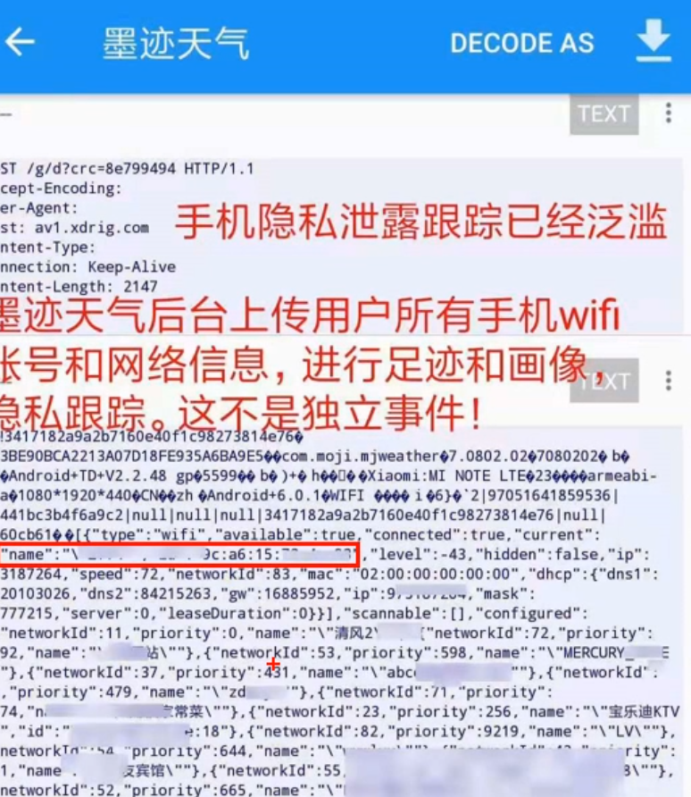
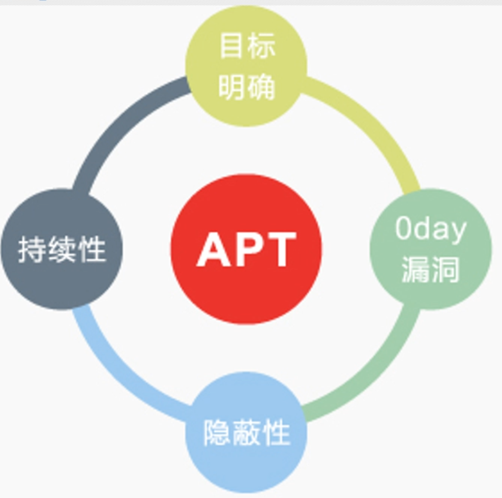
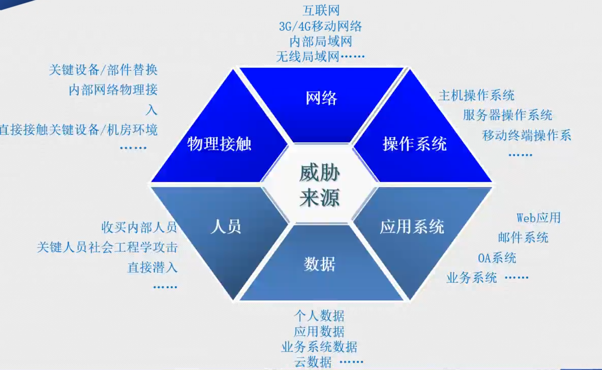
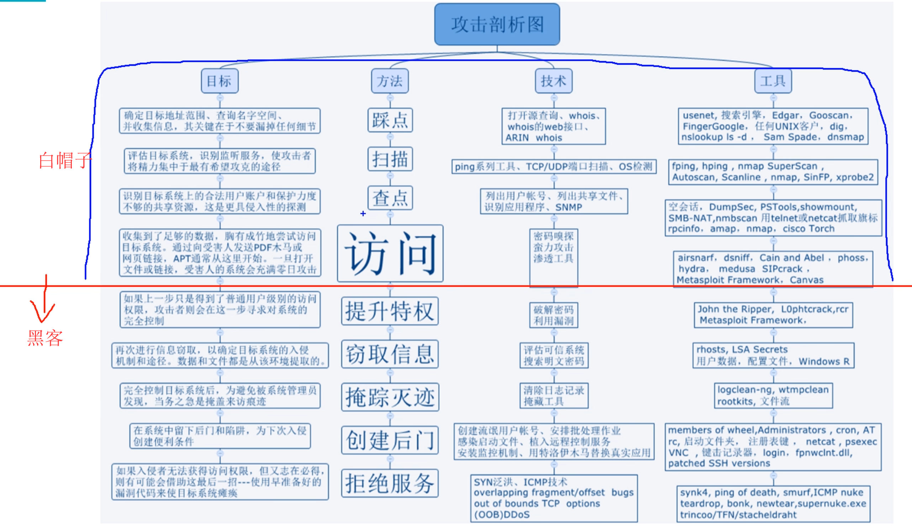
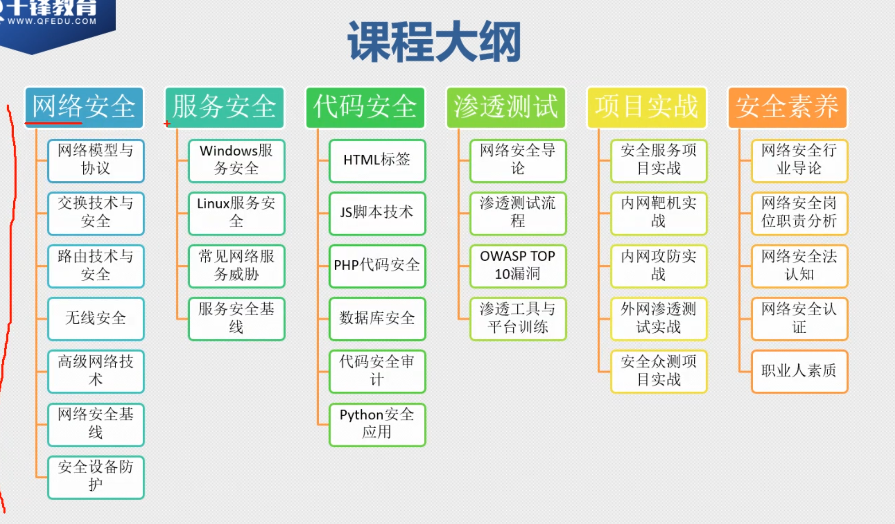
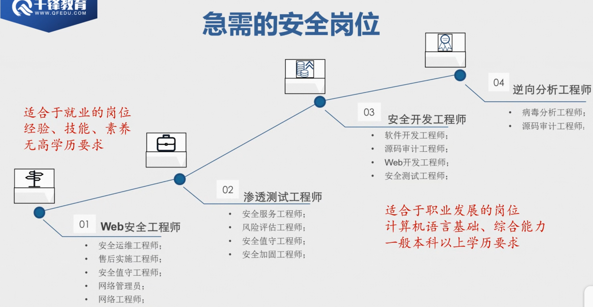

# [网络安全基础课程](https://www.bilibili.com/video/av74453287?p=1)

进度：Have Finished P3

## 浅谈网络安全

[CYBERTHREAT** REAL-TIME MAP](https://cybermap.kaspersky.com/)

[国家互联网应急中心](https://www.cert.org.cn/)

网络诈骗：
1. 2016年大学生徐玉玉被骗身亡
2. 2016年京东12G[^1-严重性]的13年数据泄露

行为：

- 黑产-脱库-登陆测试-数据提取
- 伪基站发送诈骗短信
- 分类建成信息库-提供“私家侦探服务
- 窃取目标数据，跳过调研目标，如医药企业

例子: 

- 铁人王进喜信息泄露，日本投标成功

- [Network live IP video cameras directory insecam.com](insecam.com)

央视315晚会：
某年：AI骚扰电话、wifi探针盒子[^2-原理]、

### APT[^3-全称]攻击

### 威胁来源

### 攻击剖析图：白帽子通过公安授权可进行全套攻击

### 课程大纲

### 急需的工作岗位

[^1-严重性]: 1G内容≈5亿汉字
[^2-原理]: 设备打开wifi，发送寻找信号，探针盒子接受，并识别该设备的MAC地址，而MAC地址可通过大数据转化为IMEI号，再转化为手机号码.
[^3-全称]: Advanced Pesistent Threat

